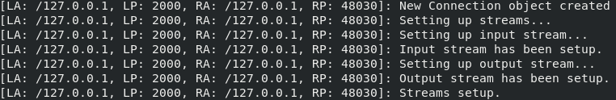

# SUIX

> **SUIX** is a piece of shit written in the world's most socially awkward language ~~ur mom gay~~ Java!
James Gosling circa 1999

## Welcome



## Protocol specification

The server reads bytes until the byte, in decimal `10`, is found. All preceding bytes are converted to their respective characters via the ASCII character codes and are placed into a String that represents the command sent from the client.

## Server implementation

The chat server a.k.a. daemon is named `suixd` and its code cna be found in the `server` directory.

### Usage

Run the server on port `[port]` with a maximum user threshold of `[threshold]`:

````
java suixd [port] [threshold]
````

## Client

The client is named `suixy` and can be found under the `client` directory.

### Usage

This client doesn't even exist yet so what are you actually fucking asking for. Can someone step the fuck up please.
